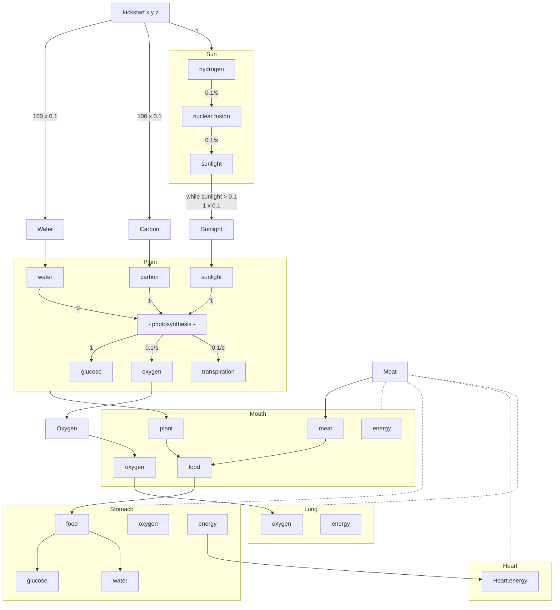

```mermaid
flowchart TD
    kickstart[kickstart x y z]
    subgraph Sun
        Sun.hydrogen[hydrogen]
        Sun.sunlight[sunlight]
        Sun.fusion[nuclear fusion]
        Sun.hydrogen -->|0.1/s| Sun.fusion -->|0.1/s| Sun.sunlight
    end
    Water --> Plant.water
    kickstart -->|1| Sun
    kickstart -->|100 x 0.1| Water
    kickstart -->|100 x 0.1| Carbon

    Carbon --> Plant.carbon

    Sun.sunlight -->|while sunlight > 0.1\n1 x 0.1| Sunlight
    Sunlight --> Plant.sunlight

    Plant.oxygen --> Oxygen
    subgraph Plant
      Plant.photosynthesis[- photosynthesis -]
      Plant.sunlight[sunlight] -->|1| Plant.photosynthesis
      Plant.carbon[carbon] -->|1| Plant.photosynthesis
      Plant.water[water] -->|2| Plant.photosynthesis
      Plant.photosynthesis -->|1| Plant.glucose[glucose]
      Plant.photosynthesis -->|0.1/s| Plant.oxygen[oxygen]
      Plant.photosynthesis -->|0.1/s| Plant.a[transpiration]
    end


    subgraph Mouth[Mouth]
      Mouth.energy[energy]
      Mouth.oxygen[oxygen]
      Mouth.plant[plant]
      Mouth.meat[meat]
      Mouth.food[food]
      Mouth.plant --> Mouth.food
      Mouth.meat --> Mouth.food
    end
    subgraph Lung
      Lung.oxygen[oxygen]
      Lung.energy[energy]
    end
    subgraph Stomach
      Stomach.oxygen[oxygen]
      Stomach.food[food]
      Stomach.energy[energy]
      Stomach.glucose[glucose]
      Stomach.water[water]
      Stomach.food --> Stomach.glucose
      Stomach.food --> Stomach.water
    end
    subgraph Heart
      Heart.energy
    end

    Mouth.oxygen --> Lung.oxygen

    Plant --> Mouth.plant

    Oxygen --> Mouth.oxygen

    Meat --> Mouth.meat

    Meat -.- Mouth
    Meat -.- Stomach
    Meat -.- Heart
    Meat -.- Lung

    Stomach.energy --> Heart.energy
    Mouth.food --> Stomach.food

```
